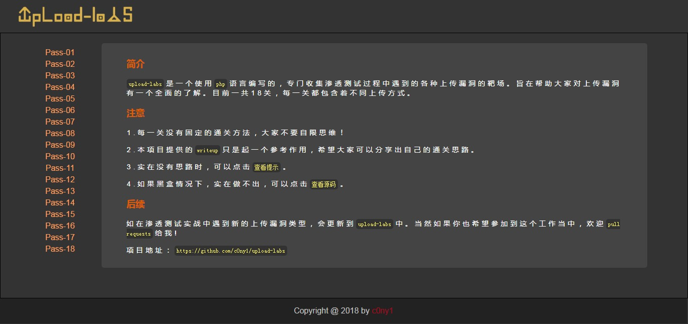
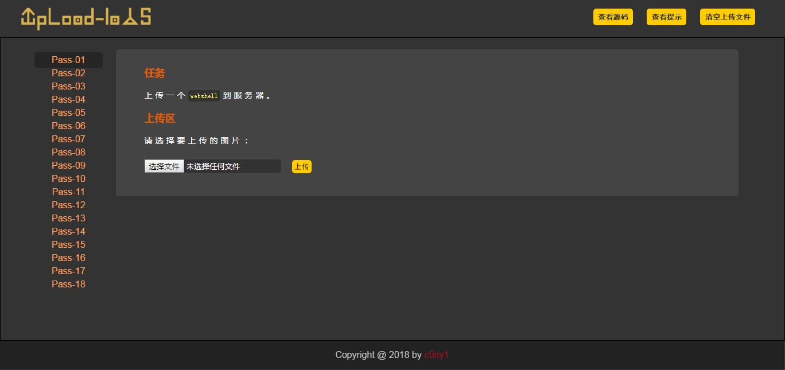
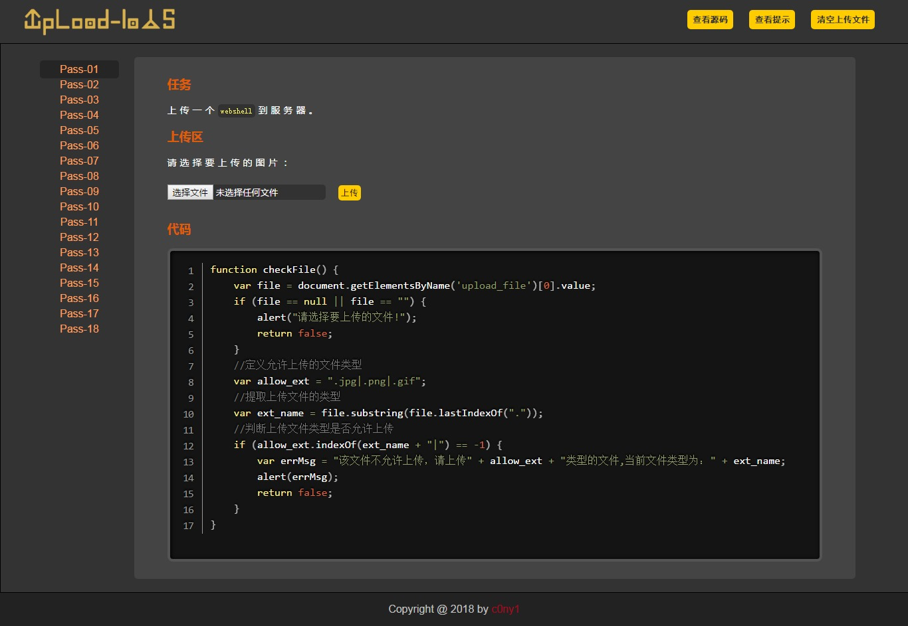
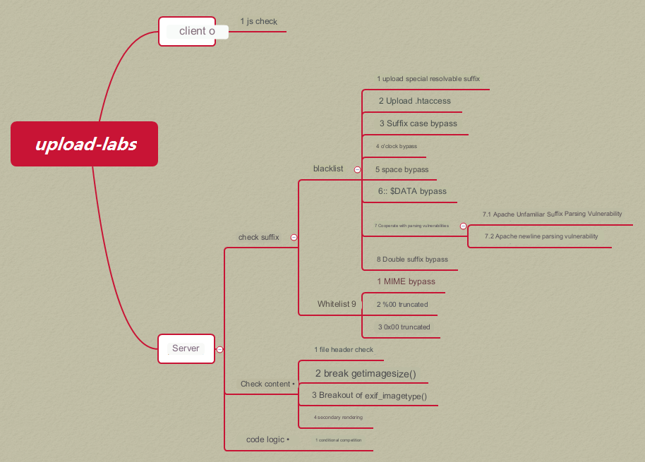
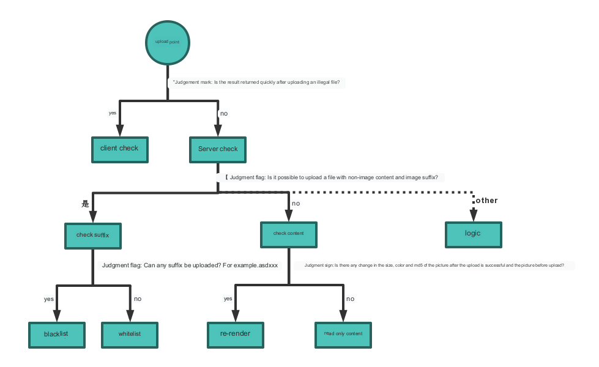

<p align="center">
  
</p>

<p align="center">
  
  
  
</p>

---

**upload-labs是一个使用php语言编写的，专门收集渗透测试和CTF中遇到的各种上传漏洞的靶场。旨在帮助大家对上传漏洞有一个全面的了解。目前一共20关，每一关都包含着不同上传方式。**

## 0x01 Screenshot

#### 1.1 主界面



#### 1.2 每一关



#### 1.3 查看代码



## 0x02 Install

#### 2.1 环境要求

若要自己亲自搭建环境，请按照以下配置环境，方可正常运行每个Pass。

|配置项|配置|描述|
|:---|:---|:---|
|操作系统|Window or Linux|推荐使用Windows，除了Pass-19必须在linux下，其余Pass都可以在Windows上运行|
|PHP版本|推荐5.2.17|其他版本可能会导致部分Pass无法突破|
|PHP组件|php_gd2,php_exif|部分Pass依赖这两个组件|
|中间件|设置Apache以moudel方式连接||

#### 2.2 Windows快速搭建

项目提供了一个Windows下,按照以上配置要求配置好的集成环环境

下载地址：https://github.com/c0ny1/upload-labs/releases

集成环境绿色免安装，解压即可使用。

#### 2.3 Linux快速搭建

创建镜像

```
$ cd upload-labs/docker
$ docker build -t upload-labs .
```

或

```
$ docker pull c0ny1/upload-labs
```

创建容器

```
$  docker run -d -p 80:80 upload-labs:latest
```

## 0x03 Summary

#### 3.1 靶机包含漏洞类型分类



#### 3.2 如何判断上传漏洞类型?



## 0x04 Thanks

* 感谢[小小黄](https://github.com/xiaoxiaoki)做的logo