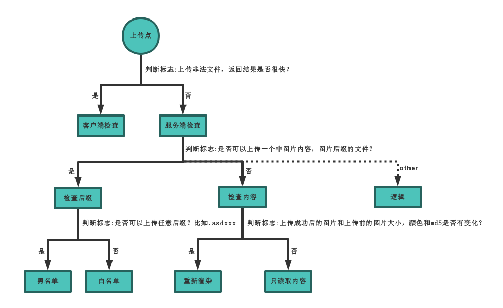

<p align="center">
  
</p>

<p align="center">
  
  
  
</p>

---

**upload-labs is a vulnerable web application written in PHP that focuses on collecting various types of file upload vulnerabilities encountered in penetration testing and Capture The Flag (CTF) challenges. Its purpose is to help users gain a comprehensive understanding of file upload vulnerabilities. There are currently 20 levels in upload-labs, with each level showcasing different upload methods and scenarios.**

## Build in linux 

```
git clone https://github.com/namhikelo/upload-labs.git
$ cd upload-labs/docker
$ docker build -t upload-labs .
$  docker run -d -p 80:80 upload-labs:latest
```

## 

## 0x03 Summary

#### 3.1 Máy mục tiêu chứa phân loại loại lỗ hổng


#### 3.2 Làm cách nào để xác định loại lỗ hổng tải lên?


